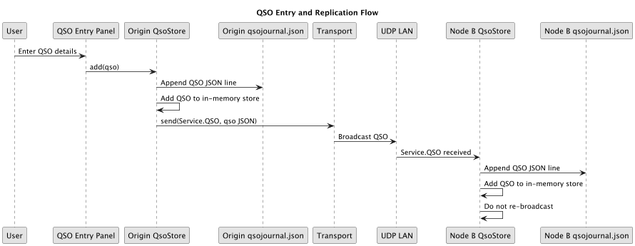

# logging QSOs

A user provides QSO details in:
Here's what happens when a user enters a QSO:

In summary the QSO is:
- Stored in the QsoStore, an in-memory collection of QSOs.
- Appended to the qsoJournal.json file.
- Broadcast, as a UDP packet, to all FdSwarm nodes.

When a node receives a QSO, it is added to its own QsoStore and appended to its qsoJournal.json file.

This works nicely for all the nodes currently in the swarm, however nodes can come and go. When I node joins the swarm, such added nodes will have missed updates.